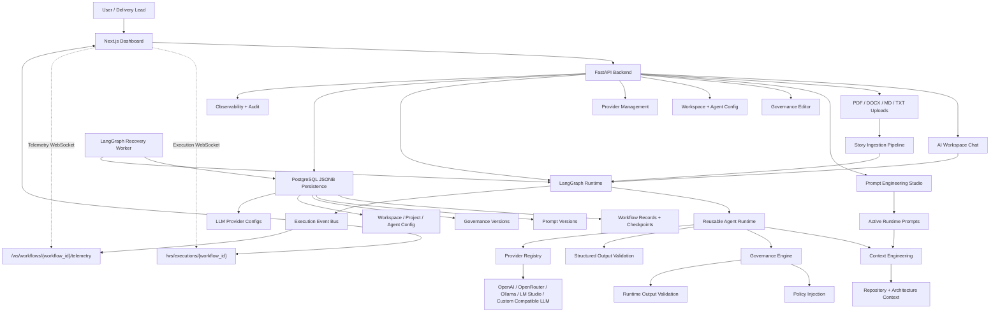
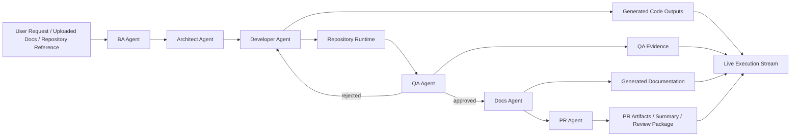
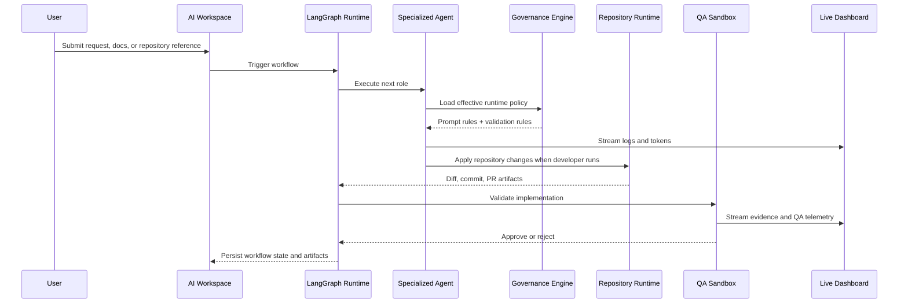
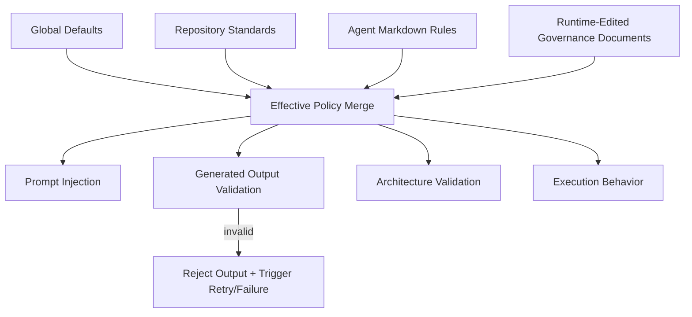
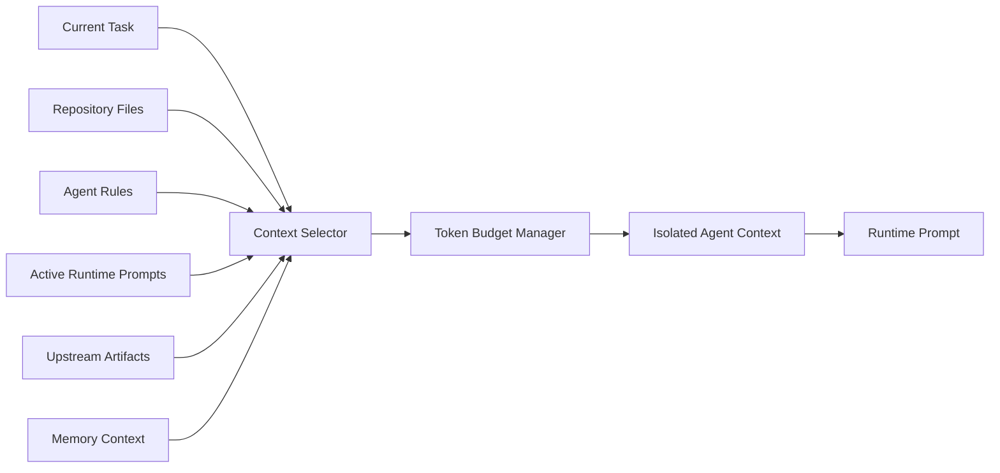
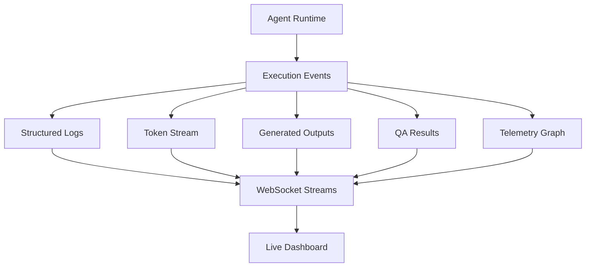

# Legion Agents - AI Software Delivery Platform

> An open-source AI-native software delivery platform for governed, observable, multi-agent engineering workflows.

[](LICENSE)
[](https://www.python.org/)
[](https://fastapi.tiangolo.com/)
[](https://nextjs.org/)
[](https://www.langchain.com/langgraph)
[](#current-status)

Legion Agents is in active **alpha mode**: a fast-evolving MVP for governed, observable, artifact-driven AI software delivery workflows.

It is a serious attempt to model how modern software delivery could work when AI agents are not treated as isolated chatbots, but as governed collaborators inside a real engineering system.

It brings together specialized AI agents, architecture standards, context engineering, runtime governance, repository modification, QA validation, prompt management, observability, and live workflow visualization into one evolving platform.

This project is not a toy agent demo. It is an AI-native SDLC foundation designed for experimentation, production hardening, and community evolution.

---

## Alpha Snapshot (2026-05-28)

### What is stable enough to use now

- Multi-agent workflow execution: `BA -> Architect -> Developer -> QA -> Docs -> PR`
- Local provider workflow support (LM Studio / local OpenAI-compatible) with compact-mode controls
- Context governor with per-agent token budgets and handoff compression
- Architect artifact generation + finalization + quality scoring
- Developer incremental project generation under `developer/generated_project/`
- Artifact persistence for prompts, outputs, structured results, handoffs, generated files, and token reports
- Governance classification with warning vs blocking behavior and non-retryable deterministic handling
- Agent Playground + step-style artifact outputs and handoff editing support

### What is still evolving

- Full UI parity for every backend diagnostic (especially governance repair visuals)
- Deeper end-to-end generated implementation quality across all stacks
- Broader local-runtime model lifecycle coverage and provider-specific edge cases
- Additional hardening for durability/replay under multi-process event streaming

### Important alpha note

For local small-context models, use compact modes and staged execution (`BA only` or `BA + Architect`) when needed. Full long workflows may still require cloud fallback depending on model/runtime limits.

---

## Table of Contents

- [Vision](#vision)
- [Origin Story](#origin-story)
- [Why This Exists](#why-this-exists)
- [Core Philosophy](#core-philosophy)
- [Key Differentiators](#key-differentiators)
- [Architecture Overview](#architecture-overview)
- [Delivery Workflow](#delivery-workflow)
- [Platform Capabilities](#platform-capabilities)
- [Governance Philosophy](#governance-philosophy)
- [AI Workspace](#ai-workspace)
- [Context Engineering](#context-engineering)
- [Autonomous QA System](#autonomous-qa-system)
- [Live Observability](#live-observability)
- [Prompt Engineering Studio](#prompt-engineering-studio)
- [Provider Configuration](#provider-configuration)
- [Multi-Agent Orchestration](#multi-agent-orchestration)
- [Docker Compose Quick Start](#docker-compose-quick-start)
- [Screenshots](#screenshots)
- [Demo Flow](#demo-flow)
- [Alpha MVP Verifier](#alpha-mvp-verifier)
- [Technical Stack](#technical-stack)
- [Enterprise Architecture](#enterprise-architecture)
- [Current Status](#current-status)
- [Roadmap](#roadmap)
- [Contributing](#contributing)
- [Design Principles](#design-principles)
- [Author](#author)
- [Contact](#contact)
- [License](#license)

---

## Vision

Software delivery is becoming AI-native.

But real engineering work does not happen through one giant prompt. It happens through roles, constraints, design tradeoffs, governance, testing, documentation, review, operational visibility, and organizational memory.

Legion Agents is built around that reality.

The vision is to create an open, extensible AI software delivery platform where specialized agents collaborate under the same kinds of expectations that shape real enterprise engineering teams:

- business analysis before implementation
- architecture before code
- governance before execution
- QA before release
- documentation before handoff
- observability across every step
- traceability for every decision

The goal is not to replace engineering judgment. The goal is to give engineers a platform where AI work becomes structured, inspectable, policy-aware, and continuously improvable.

---

## Origin Story

Legion Agents was born from a personal need: the need for a complete AI-driven software delivery platform capable of supporting real-world software engineering workflows end to end.

The agents were inspired by real collaborators and enterprise delivery roles observed during actual software projects:

- business analysts who clarify intent and acceptance criteria
- architects who protect boundaries and long-term design quality
- developers who turn specifications into concrete repository changes
- QA engineers who validate behavior and collect evidence
- documentation specialists who make systems understandable
- technical reviewers who prepare work for review and delivery

The platform attempts to capture that collaborative model in software.

Each agent is intentionally specialized. Each agent has its own context, rules, prompts, responsibilities, and output contracts. The system is designed to coordinate them as a delivery team, not collapse them into a single all-purpose model call.

---

## Why This Exists

Most AI coding tools are powerful but narrow. They can generate code, explain files, or answer questions. Fewer systems try to model the full engineering lifecycle around AI execution.

Legion Agents exists because serious AI software delivery needs more than code generation.

It needs:

- governed execution
- runtime policy enforcement
- context isolation
- repository-aware implementation
- QA evidence
- prompt versioning
- live observability
- architecture-aware decisions
- workflow replay
- editable operating rules
- clear boundaries between agent responsibilities

The project is intended as a foundation for builders who want to experiment with AI-native delivery systems, agent governance, autonomous QA, prompt operations, and enterprise-grade engineering automation.

---

## Core Philosophy

Legion Agents follows a few strong beliefs.

### Agents Should Be Specialized

The platform models a delivery organization, not a single omnipotent assistant. Each agent has a defined role, context boundary, and output contract.

### Governance Should Affect Runtime Behavior

Rules are not documentation only. Governance is injected into prompts, validated at runtime, and used to reject invalid outputs.

### Context Is an Engineering Problem

Good AI execution depends on selecting the right context at the right time. Legion Agents includes token budgeting, repository summarization, semantic file selection, architecture-aware loading, and agent context isolation.

### QA Must Produce Evidence

Quality cannot be a boolean hidden inside a model response. QA workflows should produce structured results, logs, screenshots, artifacts, and replayable evidence.

### Prompts Are Production Assets

Prompts need editing, preview, testing, versioning, rollback, token estimation, and runtime activation. Prompt operations are treated as part of the platform, not a side file.

### Observability Is Non-Negotiable

AI workflows must be inspectable while they run. The platform streams logs, agent state, token chunks, generated outputs, retries, QA telemetry, and workflow graph updates.

---

## Key Differentiators

- **Real multi-agent SDLC flow:** `BA -> Architect -> Developer -> QA -> Docs -> PR`
- **Runtime governance:** inherited policies influence prompts, validation, rejection, and execution behavior
- **Dynamic context engineering:** task-aware loading, token budgeting, semantic repository selection, and architecture prioritization
- **Repository modification:** clone, branch, modify files, diff, commit, and prepare PR artifacts
- **Autonomous QA evidence:** structured QA results, sandbox boundaries, logs, screenshots, and test artifacts
- **Live workflow visualization:** WebSocket event streams, telemetry snapshots, logs, retries, tokens, and generated outputs
- **Prompt Engineering Studio:** prompt editing, variable injection, testing, versioning, rollback, comparison, and token estimation
- **Editable governance:** global and agent rules, version history, rollback, reload events, and runtime policy inclusion
- **PostgreSQL-backed persistence:** workflow records, checkpoints, uploads, prompts, governance, workspaces, providers, and agent configuration
- **Enterprise-ready architecture:** typed contracts, clean boundaries, audit hooks, security foundations, isolated workspaces, Docker Compose topology

---

## Architecture Overview



---

## Delivery Workflow

Legion Agents models an end-to-end software delivery lane.



### Runtime Feedback Loop



---

## Platform Capabilities

### AI Delivery Execution

- Chat-driven workflow triggering
- Upload-driven workflow triggering
- Repository-aware implementation
- Multi-agent state propagation
- Retry handling
- QA rejection loops
- Structured outputs and artifacts
- Workflow history and replay foundations

### Repository Automation

- Isolated repository workspaces
- Secure Git command boundaries
- Clone, branch, diff, commit, and PR artifact preparation
- Developer output application to real files
- Repository intelligence, framework detection, dependency analysis, and architecture summarization

### Runtime Governance

- Global default rules
- Enterprise standards
- Agent-specific rules
- Runtime-edited governance documents
- Policy inheritance
- Conflict-aware merge behavior
- Runtime validation
- Output rejection
- Architecture enforcement

### Prompt Operations

- Prompt editing
- Prompt preview
- Variable injection
- Token estimation
- Prompt testing
- Version history
- Version comparison
- Rollback
- Active runtime prompt injection

### Observability

- Live execution logs
- Token streaming
- Agent status monitoring
- Retry visualization
- Generated output events
- QA telemetry
- Workflow graph snapshots
- Dashboard snapshot API
- WebSocket history replay

---

## Governance Philosophy

Legion Agents treats governance as executable system behavior.

Governance rules are loaded from multiple layers:



This means governance can influence:

- how prompts are built
- what outputs are accepted
- whether implementation is allowed to proceed
- whether architecture boundaries are respected
- whether QA expectations are satisfied

The long-term goal is a policy-aware AI engineering runtime where standards are not passive documents, but active delivery constraints.

---

## AI Workspace

The AI Workspace is the collaborative entry point for the platform.

It is designed to support:

- continuing conversations
- triggering workflows from chat
- attaching files
- referencing repositories
- streaming active agent output
- showing active workflow state
- preserving conversational context

The workspace is intended to feel less like a command console and more like an engineering room where AI agents can be directed, observed, corrected, and improved.

---

## Context Engineering

Context engineering is one of the core technical pillars of Legion Agents.

The platform avoids oversized static prompts by dynamically assembling context for each agent execution.

It supports:

- dynamic context loading
- token budgeting
- repository summarization
- semantic file selection
- architecture-aware loading
- upstream artifact loading
- active prompt injection
- governance-aware prompt sections
- agent context isolation



The system prioritizes context that is relevant to the current task, the current agent role, and the architecture of the repository being modified.

---

## Autonomous QA System

Legion Agents treats QA as an autonomous delivery role, not an afterthought.

The QA system is designed around:

- structured QA output contracts
- test execution boundaries
- Playwright and Selenium sandbox support
- screenshots
- logs
- evidence artifacts
- severity classification
- QA pass/fail routing
- rejection loops back to Developer

QA output is streamed into the live dashboard and persisted as part of the workflow artifact trail.

---

## Live Observability

AI workflows need to be visible while they run.

Legion Agents streams:

- running agents
- completed agents
- failed agents
- retries
- logs
- token chunks
- generated outputs
- QA telemetry
- workflow graph updates



The dashboard does not rely on dummy replay timers. It reads backend snapshots and live WebSocket streams.

---

## Prompt Engineering Studio

Prompt Studio is the platform’s prompt operations layer.

It supports:

- editing prompts visually
- previewing rendered prompts
- injecting variables
- estimating tokens
- testing prompts
- comparing versions
- rolling back versions
- activating prompts for runtime execution

Prompts are treated as versioned operational assets. When active prompts are saved, they can be loaded into the next matching agent execution without restarting the platform.

---

## Provider Configuration

Legion Agents is not hardcoded to one model provider. The runtime uses a provider registry with OpenAI-compatible clients, masked API key responses, provider health checks, runtime model overrides, and agent-specific model routing.

Supported MVP provider modes:

- OpenAI / Codex through `OPENAI_API_KEY`, `OPENAI_MODEL`, and `OPENAI_BASE_URL`
- OpenRouter through `OPENROUTER_API_KEY`, `OPENROUTER_BASE_URL`, and `OPENROUTER_MODEL`
- Ollama through `OLLAMA_BASE_URL` and `OLLAMA_MODEL`
- LM Studio through `LM_STUDIO_BASE_URL` and `LM_STUDIO_MODEL`
- Cursor-compatible or custom OpenAI-compatible endpoints through `OPENAI_COMPATIBLE_*`

From the UI, open:

```text
http://127.0.0.1:8080/dashboard/providers
```

From the API:

```powershell
curl -X POST http://127.0.0.1:8080/api/providers `
  -H "Content-Type: application/json" `
  -d "{\"name\":\"OpenRouter\",\"kind\":\"openrouter\",\"base_url\":\"https://openrouter.ai/api/v1\",\"api_key\":\"$env:OPENROUTER_API_KEY\",\"default_model\":\"openai/gpt-4o-mini\",\"agent_models\":{\"developer\":\"anthropic/claude-3.5-sonnet\"}}"
```

Workflow requests can override routing with metadata:

```json
{
  "task": "Implement the uploaded story",
  "metadata": {
    "provider_id": "provider-uuid",
    "model": "openai/gpt-4o-mini",
    "agent_models": {
      "developer": "anthropic/claude-3.5-sonnet",
      "qa": "openai/gpt-4o-mini"
    }
  }
}
```

Check readiness before a demo:

```powershell
curl http://127.0.0.1:8080/api/providers/health
```

At least one active provider must be configured for real LLM execution.

Model discovery and capability profiling (alpha):

- `POST /api/providers/{provider_id}/models/refresh` discovers provider models (`/v1/models` or Ollama `/api/tags`).
- `GET /api/providers/{provider_id}/models` returns persisted capability profiles used by runtime adaptation.
- `PUT /api/providers/{provider_id}/models/{model_id}` allows manual context/capability overrides when provider APIs do not expose limits.
- Runtime uses model profile budgets to adapt prompt/token limits before each call.

---

## Multi-Agent Orchestration

Legion Agents uses LangGraph to coordinate specialized AI roles.

The current delivery lane is:

```text
BA -> Architect -> Developer -> QA -> Docs -> PR
```

Each agent has:

- an isolated context package
- role-specific rules
- governance constraints
- structured output contracts
- retry behavior
- runtime telemetry
- generated artifacts

The orchestrator manages state propagation, conditional routing, retries, QA rejection loops, and checkpoint persistence.

---

## Docker Compose Quick Start

Docker Compose is the recommended local runtime.

```powershell
copy deployment\env\.env.compose.example .env.compose
docker compose --env-file .env.compose up --build
```

Open:

```text
Dashboard:       http://127.0.0.1:8080/dashboard
Backend API:     http://127.0.0.1:8080/api/health
Frontend direct: http://127.0.0.1:3000/dashboard
Backend direct:  http://127.0.0.1:8000/health
MinIO console:   http://127.0.0.1:9001
Selenium grid:   http://127.0.0.1:4444
```

Set your model credentials for real agent execution:

```powershell
notepad .env.compose
```

Fill at least one provider section, for example `OPENAI_API_KEY`, `OPENROUTER_API_KEY`, `OLLAMA_BASE_URL`, `LM_STUDIO_BASE_URL`, or a custom `OPENAI_COMPATIBLE_BASE_URL`. You can also add or update providers from `/dashboard/providers` after the stack starts.

Validate provider readiness:

```powershell
curl http://127.0.0.1:8080/api/providers/health
curl http://127.0.0.1:8080/api/health/readiness
```

Stop:

```powershell
docker compose --env-file .env.compose down
```

Reset volumes:

```powershell
docker compose --env-file .env.compose down --volumes
```

---

## Screenshots

Screenshots and hosted demos are welcome contributions.

### Dashboard

> Placeholder: Live workflow dashboard screenshot


### AI Workspace

> Placeholder: Chat-driven workflow execution screenshot


### Governance Editor

> Placeholder: Runtime governance editing screenshot


### Prompt Studio

> Placeholder: Prompt versioning and preview screenshot


---

## Demo Flow

A typical local demo flow:

1. Start the Docker Compose stack.
2. Open `/dashboard/providers` and confirm at least one provider health check is `ok`.
3. Open the AI Workspace.
4. Upload a markdown, txt, DOCX, or PDF requirements document, or type a request directly.
5. Add a Git repository URL when the workflow should clone, modify, diff, commit, and prepare PR artifacts.
6. Start a workflow from the chat.
7. Watch the live graph execute `BA -> Architect -> Developer -> QA -> Docs -> PR`.
8. Inspect streamed tokens, logs, outputs, retries, generated docs, QA evidence, and PR artifacts.
9. Edit a governance rule, roll it back if needed, and re-run the workflow.

---

## Alpha MVP Verifier

For alpha release verification, run the end-to-end MVP verifier after the stack is up.

The verifier checks:

1. API health and readiness.
2. Governance preload from markdown files.
3. Governance edit + version history.
4. Provider create, update, health, and delete.
5. Provider model profile list and manual capability override.
6. File uploads (markdown/txt).
7. Chat-triggered workflow execution.
8. Execution status, logs, and report availability.
9. Direct workflow trigger using uploaded context.

Run:

```bash
python scripts/mvp_demo_verifier.py --api-base http://127.0.0.1:8080/api
```

Optional:

```bash
python scripts/mvp_demo_verifier.py --api-base http://127.0.0.1:8080/api --timeout-seconds 360
```

Expected final line:

```text
MVP demo verification passed.
```

If it fails, the script exits with code `1` and prints the exact failing step and API error payload.
10. Edit an active prompt in Prompt Studio, preview/test it with variables, and re-run an agent.

---

## Technical Stack

### Backend

- Python 3.12+
- FastAPI
- Pydantic v2
- LangGraph
- OpenAI Python SDK
- asyncpg
- Playwright
- Selenium

### Frontend

- Next.js
- React
- TypeScript
- Tailwind CSS
- WebSocket-driven live views
- Mermaid diagrams

### Infrastructure

- Docker Compose
- PostgreSQL
- Redis
- Qdrant
- MinIO
- Nginx
- Playwright sandbox
- Selenium sandbox

### Architecture

- Clean architecture boundaries
- Typed contracts
- Async-first services
- Repository adapters
- Runtime policy validation
- Event-driven streaming
- Versioned prompt and governance stores

---

## Enterprise Architecture

Legion Agents is designed around enterprise software delivery concerns.

### Tenant and Workspace Boundaries

Workspaces isolate projects, repositories, storage roots, governance namespaces, memory namespaces, and agent configuration.

### Runtime Configuration

Prompt and governance changes are persisted and loaded dynamically. Rollbacks create new versions and affect subsequent executions.

### Auditability

The platform includes security and audit foundations for tracking workflow operations, prompt changes, governance changes, approvals, and execution history.

### Persistence

PostgreSQL JSONB adapters persist critical platform state:

- workflow records
- checkpoints
- uploads
- Prompt Studio documents
- prompt versions
- governance documents
- governance versions
- workspaces
- projects
- agent configuration

### Deployment

The local stack includes frontend, backend, worker, PostgreSQL, Redis, Qdrant, MinIO, Nginx, Playwright, and Selenium. Kubernetes-ready assets are included for future production hardening.

---

## Current Status

Alpha release status: `v0.1.0-alpha`.

Working today:

- real LangGraph workflow execution
- real multi-provider structured agent runtime
- real provider management UI and API
- real provider health and readiness checks
- real token streaming
- real workflow visualization
- real repository modification path
- real QA runtime and sandbox boundaries
- real context engineering
- real runtime governance enforcement
- real Prompt Studio versioning and rollback
- real governance versioning and rollback
- real PostgreSQL persistence adapters
- real Docker Compose runtime topology

Known limitations:

- Alpha release APIs and UI surfaces may still change before beta.
- Hosted GitHub/GitLab PR creation is not implemented yet; local PR artifacts are prepared.
- Durable multi-process event streaming should move to Redis Streams or persisted event replay.
- Jira and Notion ingestion adapters are backlog items.
- Full MinIO artifact publishing is still evolving.
- External identity provider integration is not complete.
- Qdrant-backed retrieval is boundary-ready but not yet the default memory path.
- Model context windows may still require manual tuning per provider/model in alpha, especially for local OpenAI-compatible backends.

---

## Roadmap

### Near Term

- Complete durable event replay with Redis Streams or PostgreSQL event storage.
- Publish downloadable artifacts through MinIO.
- Expand visual editing for workflow execution settings and agent configuration.
- Add Docker Compose smoke tests for PostgreSQL, worker recovery, and QA sandboxes.
- Improve generated documentation and PR artifact browsing in the dashboard.

### Mid Term

- Add hosted GitHub and GitLab PR creation.
- Add Qdrant-backed semantic memory as the default retrieval layer.
- Add external identity provider integration.
- Add policy conflict visualization and governance diff tools.
- Add richer workflow replay and checkpoint inspection.

### Long Term

- Support custom workflow graphs.
- Support custom agent packs.
- Support organization-level governance profiles.
- Support marketplace-style integrations.
- Support production-grade multi-tenant deployments.
- Support advanced evaluation suites for agent behavior.

---

## Contributing

Legion Agents is built for open-source collaboration.

Contributions are welcome in many forms:

- forks
- experiments
- bug reports
- architecture discussions
- governance rule improvements
- prompt engineering improvements
- UI/UX improvements
- agent runtime improvements
- repository provider integrations
- QA sandbox integrations
- documentation and diagrams
- deployment hardening

Good contribution areas:

- GitHub/GitLab provider adapters
- durable event streaming
- MinIO artifact publishing
- Qdrant retrieval integration
- Jira/Notion ingestion
- dashboard screenshots and demos
- workflow replay UX
- policy conflict visualization
- evaluation harnesses for agent behavior

Please open issues and discussions for larger design changes. Architecture conversations are especially welcome.

---

## Design Principles

- Keep agent responsibilities separate.
- Prefer explicit contracts over implicit behavior.
- Treat prompts as production assets.
- Treat governance as executable policy.
- Keep context bounded, relevant, and isolated.
- Make runtime behavior observable.
- Preserve auditability.
- Prefer modular extension points.
- Build for real repositories and real QA evidence.
- Keep the platform useful for individual builders and extensible for enterprises.

---

## Repository Structure

```text
agents/                  Agent-specific markdown rules, prompts, policies, diagrams
app/                     FastAPI application, routers, services, middleware, websocket
core/                    Clean architecture platform foundation
  agents/                Executable agent runtimes and model clients
  approvals/             Human approval gates and resume decisions
  chat/                  AI workspace chat and workflow triggering
  context*/              Context loading, compression, budgeting, isolation
  contracts/             Typed Pydantic contracts
  governance*/           Policy inheritance, validation, editable configs
  graph/                 LangGraph runtime, persistence, worker, orchestration
  ingestion/             Story/document ingestion pipeline
  memory/                Memory and semantic intelligence boundaries
  persistence/           PostgreSQL JSONB adapters
  pr_review/             Autonomous PR review and readiness scoring
  prompt_studio/         Prompt editing, testing, versioning, rollback
  qa_sandbox/            Playwright/Selenium evidence sandbox
  repository*/           Git runtime and repository intelligence
  runtime/               Base agent runtime abstractions
  security/              JWT, RBAC, immutable audit
  streaming/             Event bus, token events, logs, timelines, telemetry
  workspaces/            Tenant-aware projects, repositories, permissions, config
deployment/              Docker, Compose, env templates, Nginx, Kubernetes-ready assets
frontend/                Next.js dashboard
tests/                   Backend foundation and runtime tests
```

---

## About the Builder

**Fausto**

Legion Agents is a personal-time, long-term AI engineering and platform experiment built by a real engineer who has spent a lot of time thinking about software delivery, architecture boundaries, QA loops, team collaboration, and how AI systems should behave when the work gets serious.

I have been a programming enthusiast since childhood, and I still carry that same curiosity into the way I build software today. I am a platform engineering nerd, a wannabe tech lead in the best possible sense, a proud father, and someone who enjoys chasing the shape of systems until they start to feel coherent.

This project comes from that mix: professional software delivery experience, curiosity about AI agents, appreciation for the people I have worked with, and a slightly stubborn belief that AI engineering should be more structured, observable, governed, and human than a pile of prompts.

It is also intentionally open-source. Fork it, break it, question it, extend it, argue with the architecture, improve the prompts, add integrations, replace pieces, or use it as a playground for your own AI delivery experiments.

## Acknowledgements

This project exists because software is never really built alone.

Thank you to **Katy**, **Cris**, and **Cristhian** for the conversations, support, ideas, and real-world engineering context that shaped how I think about collaboration and delivery.

A special thank-you to my wife, for the patience while I kept building this platform during personal time, late nights, and many "just one more thing" moments.

And to my daughter: you are the inspiration behind everything. This project carries a little bit of the future I hope to help build for you.

---

## Contact

- Email: [fhuamanr@gmail.com](mailto:fhuamanr@gmail.com)
- Email: [chuamanr@icloud.com](mailto:chuamanr@icloud.com)
- LinkedIn: [carloshuamanrengifo](https://www.linkedin.com/in/carloshuamanrengifo)
- GitHub: [fhuamanr](https://github.com/fhuamanr)

I am always happy to connect with people interested in software engineering, AI systems, platform architecture, QA automation, developer tools, and open-source collaboration.

## Closing Note

If you are in Lima, Peru and want to grab a coffee to talk about:

- software engineering
- AI
- football
- videogames
- platform architecture
- or just nerd stuff in general

feel free to reach out.

Legion Agents is still evolving, and that is the point. It is a serious engineering platform, but it is also an invitation to explore what AI-native software delivery can become when builders bring curiosity, discipline, and community into the same room.


---

## License

Legion Agents is licensed under the [Apache License 2.0](LICENSE).

You are encouraged to fork it, experiment with it, extend it, challenge its architecture, and help shape what AI-native software delivery systems can become.
### Frontend Healthcheck Notes

- Frontend container health is validated via `http://127.0.0.1:3000/api/health`.
- The dashboard route (`/dashboard`) is not used for container health because it depends on runtime data fetches.
- Server-side frontend API calls use `INTERNAL_API_BASE_URL` (Compose default: `http://backend:8000`) to avoid container-local `127.0.0.1` routing issues.

Troubleshooting commands:

```bash
docker compose --env-file .env.compose ps
docker compose --env-file .env.compose logs frontend --tail=200
docker inspect ai-delivery-platform-frontend-1 --format='{{json .State.Health}}'
```
### Local LM Studio Safe Mode (Recommended for 32GB RAM laptops)

- Set `LOCAL_LM_STUDIO_SAFE_MODE=true` for workflow execution with local LM Studio models.
- Behavior in safe mode:
  - workflow agents run non-streaming by default (chat streaming remains enabled)
  - BA prompt is compacted and hard-limited (`<=1200` prompt tokens, `<=700` output reserve)
  - max concurrent workflow execution path is serialized in backend
  - context-window/model-unloaded/invalid-request style failures are surfaced without retry loops
- Recommended LM Studio settings (32GB RAM + Docker/Rancher):
  - Qwen2.5-Coder 7B or 14B Q4_K_M
  - `n_parallel=1`
  - `n_ctx=8192` if stable, otherwise `4096`
  - avoid dense 24B local models for full multi-agent runs
  - keep BA compact mode enabled
  - use cloud/OpenRouter for full-repository workflows if local inference is unstable
