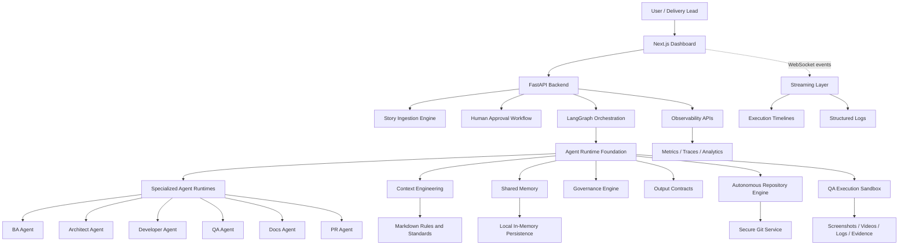
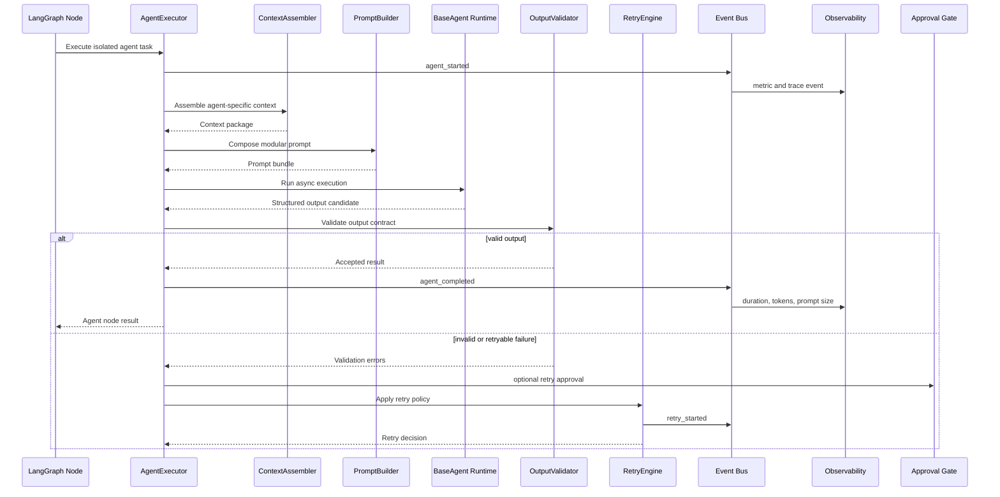
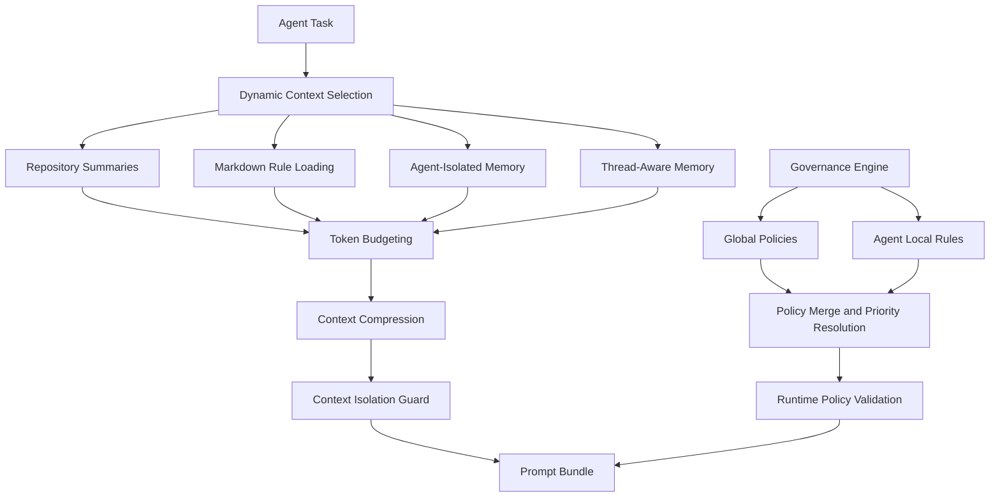
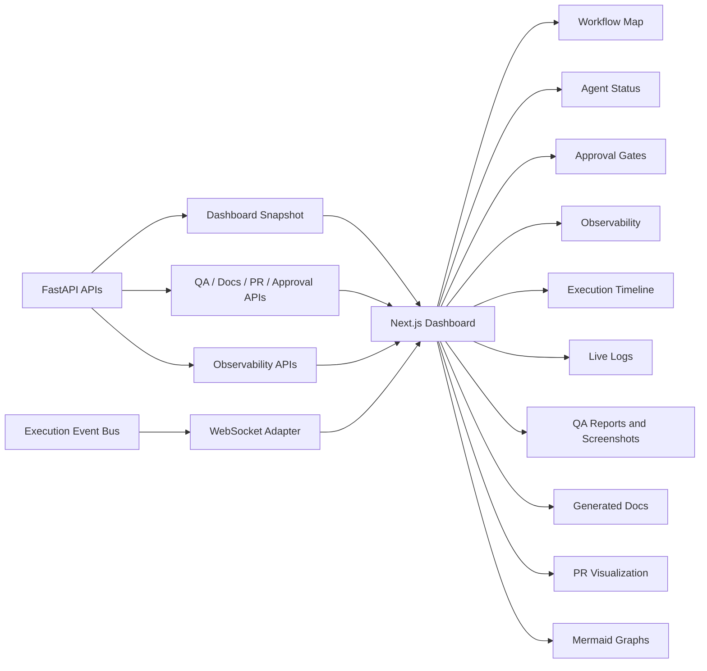
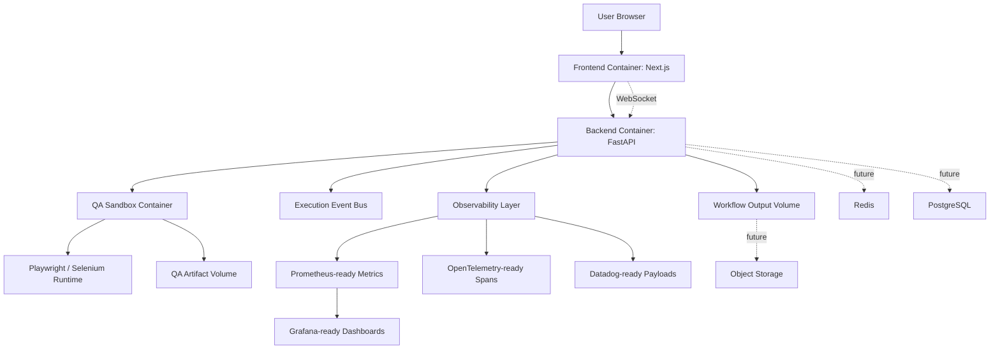

# Enterprise Multi-Agent Software Delivery Platform

Python/LangGraph foundation for an enterprise-grade multi-agent software delivery platform with a Next.js operational dashboard.

The platform is organized around specialized agents with isolated responsibilities:

- `ba`
- `architect`
- `developer`
- `qa`
- `docs`
- `pr`

The implementation currently focuses on reusable platform infrastructure: contracts, user story ingestion, context engineering, shared memory, autonomous repository operations, runtime execution, LangGraph orchestration, QA sandboxing, human approvals, governance, observability, real-time execution streaming, FastAPI APIs, production deployment assets, and a frontend dashboard for monitoring workflows.

## Architecture

```text
agents/                  Agent-specific markdown rules, constraints, prompts, and diagrams
app/                     FastAPI backend platform
  dependencies/          Dependency injection providers
  middleware/            Request and telemetry middleware
  routers/               Workflow, execution, upload, agent, approval, observability, health, QA, docs, and PR APIs
  services/              Application services over core platform abstractions
  websocket/             WebSocket-ready execution event endpoints
core/
  approvals/             Human approval gates, workflow pauses, and resume decisions
  agents/                Executable agent runtimes
    developer/           Developer Agent runtime
    qa/                  QA Agent runtime
  context/               Raw context loading and section classification
  context_engineering/   Smart context selection, compression, summaries, and budgeting
  contracts/             Pydantic schemas and output contracts
  governance/            Policy loading, inheritance, merging, validation, and standards registry
  graph/                 LangGraph orchestration infrastructure
  ingestion/             User story ingestion pipeline, parsers, normalization, validation, extraction
  memory/                Shared memory system with local persistence
  observability/         Metrics, tracing, analytics, error tracking, and exporter boundaries
  prompts/               Prompt composition primitives
  qa_sandbox/            Isolated Playwright/Selenium execution sandbox and artifacts
  repository/            Autonomous repository runtime, Git service, workspace manager, diff analyzer
  runtime/               Reusable base runtime architecture
  streaming/             Execution event bus, telemetry, timelines, and structured logging
deployment/              Docker, Compose, production config, Kubernetes-ready manifests, deployment docs
frontend/                Next.js, TypeScript, Tailwind, Shadcn-style dashboard
repository/              Shared repository standards
tests/                   Unit tests for platform foundations
workflows/               Future workflow definitions
outputs/                 Generated local runtime outputs
```

## Solution Diagrams

### Platform Layers



### Delivery Workflow

```mermaid
flowchart LR
  Input["Markdown / TXT / DOCX / PDF Stories"] --> Ingestion["Story Ingestion and Normalization"]
  Ingestion --> BA["BA: user stories and acceptance criteria"]
  BA --> Architect["Architect: architecture context"]
  Architect --> Developer["Developer: code, tests, refactor plan, PR draft"]
  Developer --> Repo["Repository Runtime: branch, diff, commit, PR package"]
  Repo --> QA["QA: tests, browser evidence, bug reports"]
  QA --> Sandbox["QA Sandbox: Playwright / Selenium"]
  Sandbox -->|evidence| QA
  QA -->|approved| Approval["Human Gate: PR / release approval"]
  QA -->|override requested| Approval
  Approval -->|approved| Docs["Docs: generated documentation"]
  QA -->|rejected with bugs| Developer
  Docs --> PR["PR: GitLab-ready summary"]
```



### Agent Runtime Execution



### Context, Memory, and Governance



### Dashboard and Streaming



### Production Deployment



## Current Capabilities

- Typed Pydantic contracts for agents, artifacts, context, execution, memory, prompts, outputs, and workflow state.
- User Story Ingestion Engine for markdown, txt, docx, pdf, and future Jira/Notion adapters.
- Context loading from markdown and Mermaid files.
- Context engineering with dynamic selection, compression, token budgeting, repository summaries, architecture summaries, memory retrieval, and leakage prevention.
- Shared memory system with short-term memory, long-term memory, execution history, ADR memory, bug memory, checkpoint-compatible records, namespaces, and vector-ready interfaces.
- Autonomous Repository Engine with isolated workspaces, secure Git commands, cloning, branching, diff analysis, commit generation, PR preparation, and summaries.
- LangGraph orchestration with supervisor routing, conditional edges, retry loops, QA rejection loops, workflow transition metadata, and minimal shared graph state.
- Reusable runtime foundation with `BaseAgent`, `AgentExecutor`, prompt building, context assembly, output validation, retry engine, logging hooks, and tool registry.
- Executable Developer Agent runtime with dynamic markdown rule loading, repository analysis, structured outputs, retry-safe execution, and telemetry hooks.
- Autonomous QA Agent runtime with unit, integration, Playwright, Selenium, screenshot, bug report, severity, evidence, and coverage output contracts.
- QA Execution Sandbox with isolated browser sessions, screenshot/video/log/evidence artifact generation, and Docker/Kubernetes-ready execution config.
- Human Approval Workflow with approval gates, manual reviews, retry approvals, PR approvals, QA override approvals, workflow pauses, reviewer tracking, and resume decisions.
- Agent Governance Engine with global policies, local override controls, rule inheritance, policy merging, standards registry, markdown loading, and runtime validation.
- Dynamic Governance Management UI and APIs for editing gravity rules, anti-gravity rules, personalities, prompts, coding standards, and QA policies with live persistence, version history, rollback, and reload events.
- Real-time execution streaming with async event bus, execution tracker, timeline generator, structured logging, telemetry layer, and WebSocket-ready events.
- Observability and telemetry architecture with metrics, tracing, execution telemetry, workflow analytics, agent analytics, error tracking, Prometheus text output, OpenTelemetry-ready spans, Datadog-ready JSON, and Grafana dashboard models.
- FastAPI backend with modular routers for workflows, executions, uploads, agent status, approvals, observability, health checks, QA reports, generated docs, PR summaries, and WebSocket execution events.
- Next.js dashboard with workflow visualization, agent status monitoring, approval gates, observability, execution timelines, live logs, QA reports, screenshot evidence, generated documentation, Mermaid diagrams, and PR visualization.
- Production deployment architecture with Dockerfiles, Docker Compose, environment templates, production config, CI workflow, and Kubernetes-ready manifests.

## Default Workflow

```text
BA -> Architect -> Developer -> QA -> Docs -> PR
```

The orchestration layer also supports:

- QA rejection loop: `QA -> Developer -> QA`
- retry execution
- conditional routing through route metadata
- isolated agent execution
- minimal shared graph state
- execution metadata for UI/API consumers

## Backend API

The FastAPI application is located in `app/`.

Run the backend:

```powershell
python -m uvicorn app.main:app --reload --host 127.0.0.1 --port 8000
```

Core API areas:

- workflow upload and triggering
- execution status and logs
- agent status
- approval gate creation, decisions, pause state, and resume state
- governance configuration editing, version history, rollback, and reload history
- observability snapshots, metrics, workflow analytics, agent analytics, and exporter payloads
- QA report retrieval
- generated documentation retrieval
- PR summary retrieval
- health checks
- WebSocket-ready execution streams

## Frontend Dashboard

The dashboard is located in `frontend/` and uses:

- Next.js App Router
- TypeScript
- Tailwind CSS
- Shadcn-style UI primitives
- Lucide icons
- Mermaid rendering
- approval gate visualization
- governance markdown editor and version history
- observability analytics panels
- WebSocket-ready execution streaming

Run the dashboard:

```powershell
cd frontend
npm.cmd install
npm.cmd run dev -- --hostname 127.0.0.1 --port 3000
```

Open:

```text
http://127.0.0.1:3000/dashboard
```

Optional integration variables:

```text
NEXT_PUBLIC_API_BASE_URL=http://127.0.0.1:8000
NEXT_PUBLIC_WS_BASE_URL=ws://127.0.0.1:8000
```

Without those variables, the dashboard uses typed mock data so the UI remains executable during backend integration.

## Deployment

Production deployment assets live in `deployment/`.

- Dockerfiles: `deployment/docker/`
- Compose files: `deployment/compose/`
- environment templates: `deployment/env/`
- production configuration: `deployment/config/`
- future Kubernetes manifests: `deployment/kubernetes/`
- deployment guide: `deployment/docs/production-deployment.md`
- full local platform guide: `deployment/docs/docker-compose-platform.md`
- CI workflow: `.github/workflows/ci.yml`

Full local platform run:

```powershell
copy deployment\env\.env.compose.example .env.compose
docker compose --env-file .env.compose up --build
```

The root Compose stack includes frontend, FastAPI backend, LangGraph runtime, PostgreSQL, Redis, Qdrant, Playwright sandbox, Selenium sandbox, MinIO, and Nginx.

## Agent Rule Loading

Developer runtime reads:

- `agents/developer/gravity.md`
- `agents/developer/anti-gravity.md`
- `agents/developer/coding-standards.md`
- `agents/developer/architecture.md`
- `agents/developer/forbidden.md`
- `agents/developer/naming.md`
- `agents/developer/testing.md`
- `agents/developer/security.md`

QA runtime reads:

- `agents/qa/gravity.md`
- `agents/qa/anti-gravity.md`
- `agents/qa/severity-rules.md`
- `agents/qa/test-strategy.md`

## Setup

Install backend dependencies:

```powershell
python -m pip install -r requirements.txt
```

Install frontend dependencies:

```powershell
cd frontend
npm.cmd install
```

## Verification

Run backend tests:

```powershell
python -m pytest -p no:cacheprovider tests
```

Run frontend checks:

```powershell
cd frontend
npm.cmd run typecheck
npm.cmd run build
```

Current test coverage validates:

- contract imports and schema behavior
- context loading
- context engineering
- memory isolation and retrieval
- LangGraph orchestration
- runtime foundation
- Developer Agent runtime
- QA Agent runtime
- user story ingestion
- autonomous repository runtime
- QA execution sandbox
- human approval workflow
- dynamic governance management
- governance policy loading, inheritance, merging, and validation
- execution streaming, timelines, logs, and telemetry
- observability metrics, traces, analytics, exporters, and API routes
- FastAPI backend routing and service boundaries
- frontend type safety and production build

## Extension Points

- Add external persistence by implementing `MemoryRepository`.
- Add Redis/PostgreSQL adapters behind the memory abstractions.
- Add vector database support by implementing `VectorMemoryRepository`.
- Add real browser automation by implementing `BrowserAutomationDriver`.
- Add real Playwright/Selenium adapters behind `BrowserSandboxDriver`.
- Add model providers by implementing `AgentModelClient`.
- Add governance YAML support behind the policy loader.
- Add WebSocket delivery adapters over the streaming event bus.
- Add GitLab SaaS integration behind PR and workflow service adapters.
- Add GitHub/GitLab repository providers behind `RepositoryProviderAdapter`.
- Add external observability exporters behind the observability service.
- Add production object storage for workflow and QA artifacts.
- Add new specialized agents by creating isolated runtime packages under `core/agents/`.

## Design Principles

- Do not collapse agent responsibilities.
- Keep prompts modular and agent-specific.
- Keep orchestration separate from business logic.
- Keep context isolated per agent.
- Keep memory thread-aware and agent-isolated.
- Prefer reusable abstractions and typed contracts.
- Use async-first execution boundaries.
- Keep local infrastructure replaceable by production adapters.
