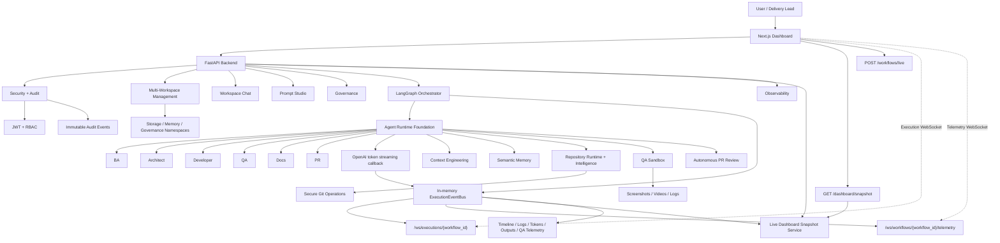
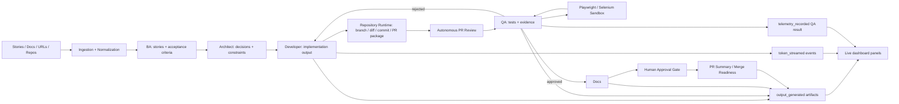
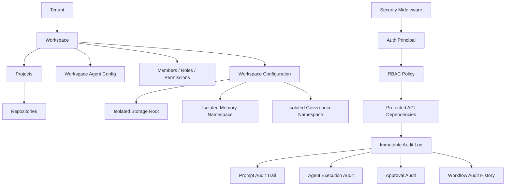
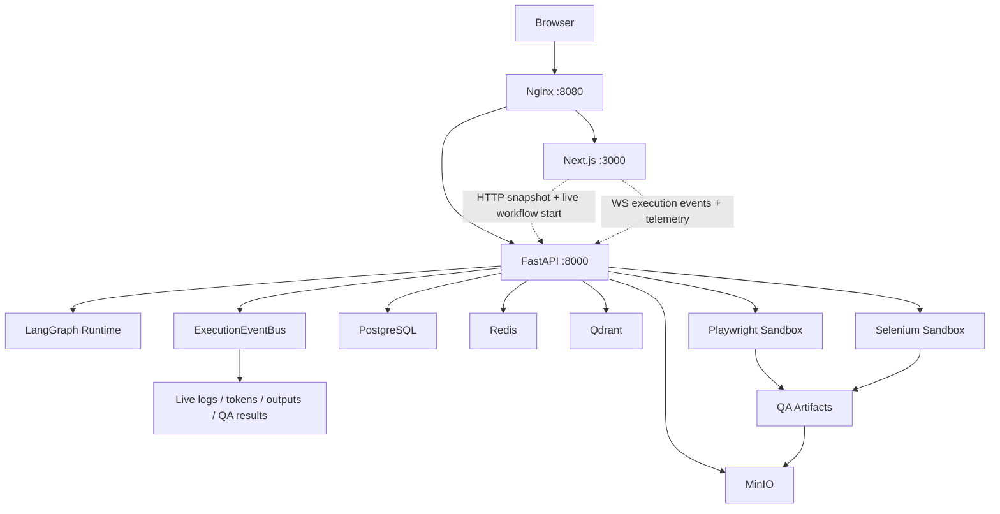

# Enterprise Multi-Agent Software Delivery Platform

Python 3.12+/LangGraph foundation for an enterprise software delivery control plane. The platform coordinates specialized agents, repository automation, QA evidence, governance, approvals, prompt operations, security, audit, and a Next.js dashboard.

Specialized agents remain isolated:

- `ba`
- `architect`
- `developer`
- `qa`
- `docs`
- `pr`

## Quick Start

Docker Compose is the canonical local runtime. It starts the frontend, FastAPI backend, LangGraph worker placeholder, PostgreSQL, Redis, Qdrant, MinIO, Playwright sandbox, Selenium sandbox, and Nginx reverse proxy.

```powershell
copy deployment\env\.env.compose.example .env.compose
docker compose --env-file .env.compose up --build
```

Open:

```text
Dashboard:       http://127.0.0.1:8080/dashboard
Backend API:     http://127.0.0.1:8080/api/health
Frontend direct: http://127.0.0.1:3000/dashboard
Backend direct:  http://127.0.0.1:8000/health
MinIO console:   http://127.0.0.1:9001
Selenium grid:   http://127.0.0.1:4444
```

Stop or reset:

```powershell
docker compose --env-file .env.compose down
docker compose --env-file .env.compose down --volumes
```

## Architecture

```text
agents/                  Agent-specific markdown rules, prompts, policies, diagrams
app/                     FastAPI application, routers, services, middleware, websocket
core/                    Clean architecture platform foundation
  agents/                Executable Developer and QA runtimes
  approvals/             Human gates, pauses, resume decisions
  chat/                  AI workspace chat and workflow triggering
  context*/              Context loading, compression, budgeting, isolation
  contracts/             Typed Pydantic contracts
  governance*/           Policy inheritance, validation, editable configs
  graph/                 LangGraph orchestration infrastructure
  ingestion/             Story/document ingestion pipeline
  memory/                Memory plus semantic intelligence and vector boundaries
  pr_review/             Autonomous PR review and readiness scoring
  prompt_studio/         Prompt editing, testing, versioning, comparison, rollback
  qa_sandbox/            Playwright/Selenium evidence sandbox
  repository*/           Git runtime and repository intelligence
  runtime/               Base agent runtime abstractions
  security/              JWT, RBAC, immutable audit
  streaming/             Real event bus, token events, logs, timelines, telemetry
  workspaces/            Tenant-aware projects, repositories, permissions, config
deployment/              Docker, Compose, env templates, Nginx, Kubernetes-ready assets
frontend/                Next.js dashboard
tests/                   Backend foundation tests
```

## System Map



## Delivery Flow



## Enterprise Boundaries



## Docker Compose Topology



## Capabilities

- **Orchestration:** LangGraph supervisor, typed graph state, conditional routing, retries, QA rejection loops, workflow metadata.
- **Agent Runtime:** reusable base runtime, Developer runtime, QA runtime, prompt building, context assembly, output validation, retries, telemetry hooks, and OpenAI token streaming callbacks.
- **Context and Memory:** markdown loading, context compression, token budgeting, isolated agent context, short/long-term memory, ADR/bug/execution history memory, semantic indexing, vector-ready retrieval, Qdrant-ready boundary.
- **Workspace and Project Management:** tenant-aware workspaces, projects, repository bindings, workspace permissions, workspace-specific agent config, isolated storage/memory/governance namespaces.
- **Repository Automation:** isolated Git workspaces, clone/branch/diff/commit/PR preparation, repository scanning, framework detection, dependency graphing, architecture summaries.
- **Quality and Review:** autonomous QA output contracts, Playwright/Selenium sandbox boundaries, screenshot/log/evidence artifacts, autonomous PR review, structured comments, severity classification, merge readiness scoring.
- **Governance and Prompts:** global and agent policies, inheritance, policy validation, editable governance UI, Prompt Engineering Studio with markdown editing, variables, preview, testing, versioning, comparison, rollback, token estimation.
- **Security and Audit:** JWT auth boundary, RBAC roles/permissions, optional security middleware, route dependency helpers, immutable hash-chained audit events, audit APIs.
- **Observability and Streaming:** execution event bus, event history replay on WebSocket connect, live logs, token chunks, generated output events, QA telemetry, timelines, workflow telemetry, metrics, traces, analytics, Prometheus/OpenTelemetry/Datadog/Grafana-ready outputs.
- **Dashboard:** Next.js App Router UI backed by `/dashboard/snapshot`, execution and telemetry WebSockets, live workflow graph, agent status, retries, tokens, generated outputs, QA results, approvals, observability, QA reports, docs, PR summaries, Mermaid diagrams, and an empty live-state shell when no backend is configured.

## Real Streaming Components

- `ExecutionEventBus`: in-memory async pub/sub and event history source for workflow-scoped execution events.
- `ExecutionEventEmitter` and `StructuredExecutionLogger`: emit agent lifecycle, retry, progress, log, token, output, and QA telemetry events.
- `LangGraphExecutionRuntime`: runs the real BA -> Architect -> Developer -> QA -> Docs -> PR graph and passes token callbacks into agent requests.
- `OpenAIChatModelClient.stream_complete`: streams model deltas into `token_streamed` events when the real OpenAI client is active.
- `/workflows/live`: returns a workflow id immediately and executes the real workflow in the background so clients can subscribe before completion.
- `/ws/executions/{workflow_id}`: replays real event history, then streams new execution events live.
- `/ws/workflows/{workflow_id}/telemetry`: streams live workflow graph snapshots after every workflow event.
- `/dashboard/snapshot`: builds the dashboard state from the latest real workflow, event history, generated artifacts, QA telemetry, logs, retries, and token counters.
- `useExecutionStream` and `useWorkflowTelemetry`: consume websocket data only; they no longer synthesize replayed or timer-driven execution movement.

## API Areas

- `/auth/*` and `/audit/*`: JWT, access checks, audit events
- `/workspaces/*`: tenants, workspaces, projects, repository bindings, isolation summary
- `/workspace/chat/*`: chat conversations, uploads, references, workflow triggering
- `/workflows/*` and `/executions/*`: workflow lifecycle, immediate live workflow start, status, logs, telemetry
- `/approvals/*`: gates, decisions, pauses, resumes
- `/governance/configs/*`: editable governance, versions, rollback
- `/prompt-studio/prompts/*`: prompt CRUD, preview, testing, versions, compare, rollback
- `/observability/*`: metrics, traces, analytics, exporters
- `/reports/*`, `/docs/*`, `/pr/*`: QA reports, generated docs, PR summaries
- `/dashboard/snapshot`: latest real workflow dashboard snapshot assembled from execution state and event history
- `/ws/*`: execution, workflow telemetry, chat streams; execution sockets replay history and then stream live events

## Local Development

Backend:

```powershell
python -m pip install -r requirements.txt
python -m uvicorn app.main:app --reload --host 127.0.0.1 --port 8000
```

Frontend:

```powershell
cd frontend
npm.cmd install
npm.cmd run dev -- --hostname 127.0.0.1 --port 3000
```

Optional frontend integration:

```text
NEXT_PUBLIC_API_BASE_URL=http://127.0.0.1:8000
NEXT_PUBLIC_WS_BASE_URL=ws://127.0.0.1:8000
```

Without those variables, execution views render an empty live-state shell. The old dummy execution visualization and mock event replay have been removed.

## Verification

Backend:

```powershell
python -m pytest -p no:cacheprovider tests
```

Frontend:

```powershell
cd frontend
npm.cmd run typecheck
npm.cmd run build
```

Latest targeted streaming/API verification: `15 passed` for `tests\test_execution_streaming.py`, `tests\test_fastapi_backend.py`, and `tests\test_chat_workflow_execution.py`.

## Deployment Assets

- Root local stack: `docker-compose.yml`
- Dockerfiles: `deployment/docker/`
- Nginx: `deployment/nginx/nginx.conf`
- Env templates: `deployment/env/`
- Production config: `deployment/config/`
- Compose docs: `deployment/docs/docker-compose-platform.md`
- Production guide: `deployment/docs/production-deployment.md`
- Kubernetes-ready manifests: `deployment/kubernetes/`

## Design Principles

- Never collapse agent responsibilities.
- Keep prompts modular and agent-specific.
- Keep orchestration, memory, context, prompts, governance, and execution separate.
- Keep tenant/workspace boundaries explicit.
- Keep audit events immutable.
- Prefer typed contracts and async-first boundaries.
- Keep local in-memory implementations replaceable by Redis, PostgreSQL, Qdrant, object storage, and enterprise identity providers.
