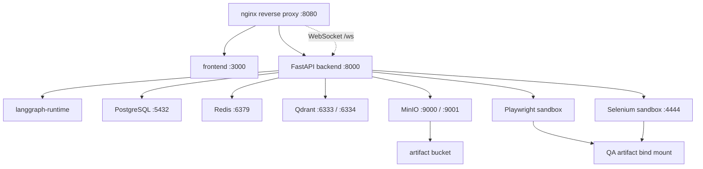

# Full Local Docker Compose Platform

The root `docker-compose.yml` runs the complete AI delivery platform locally with one command.

## Services



## Run

```powershell
copy deployment\env\.env.compose.example .env.compose
docker compose --env-file .env.compose up --build
```

Open:

- Dashboard: `http://127.0.0.1:8080/dashboard`
- Backend API: `http://127.0.0.1:8080/api/health`
- Direct backend: `http://127.0.0.1:8000/health`
- MinIO console: `http://127.0.0.1:9001`
- Selenium Grid: `http://127.0.0.1:4444`
- Qdrant: `http://127.0.0.1:6333`

## Hot Reload

- `frontend` bind mounts `frontend/` and runs `next dev`.
- `backend` bind mounts `app/`, `core/`, `workflows/`, and `outputs/`, and runs `uvicorn --reload`.
- `langgraph-runtime` bind mounts `core/`, `agents/`, `repository/`, and `outputs/`.
- sandbox artifacts are written to `outputs/qa_sandbox`.

## Networks

- `edge`: public ingress network for Nginx and frontend.
- `app`: application network for frontend, backend, runtime, and sandbox coordination.
- `data`: internal-only network for PostgreSQL, Redis, Qdrant, and MinIO.
- `sandbox`: browser execution network for Playwright and Selenium isolation.

## Persistent Storage

- `postgres-data`: PostgreSQL data.
- `redis-data`: Redis append-only data.
- `qdrant-data`: vector database collections.
- `minio-data`: object storage buckets.
- `frontend-node-modules`: frontend dependencies inside container.
- `frontend-next-cache`: local Next.js cache.
- `backend-logs`: backend logs.
- `outputs/`: workflow outputs and QA artifacts bind-mounted from the host.

## Environment Separation

- Local full-stack template: `deployment/env/.env.compose.example`
- Local lightweight template: `deployment/env/.env.local.example`
- Production template: `deployment/env/.env.production.example`

Real secrets should be placed in an untracked `.env.compose` or injected by the orchestrator in shared environments.

## Scaling

The compose file is shaped so stateless services can scale:

```powershell
docker compose --env-file .env.compose up --scale backend=2 --scale langgraph-runtime=2
```

For production, prefer the Kubernetes overlays in `deployment/kubernetes/` and replace local volumes with managed storage.

