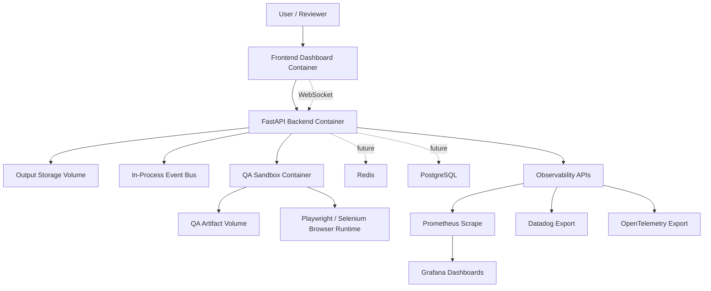
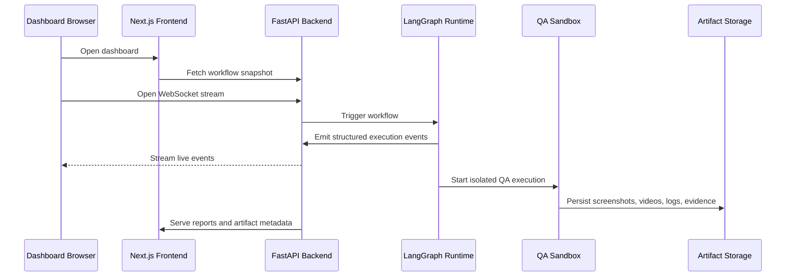
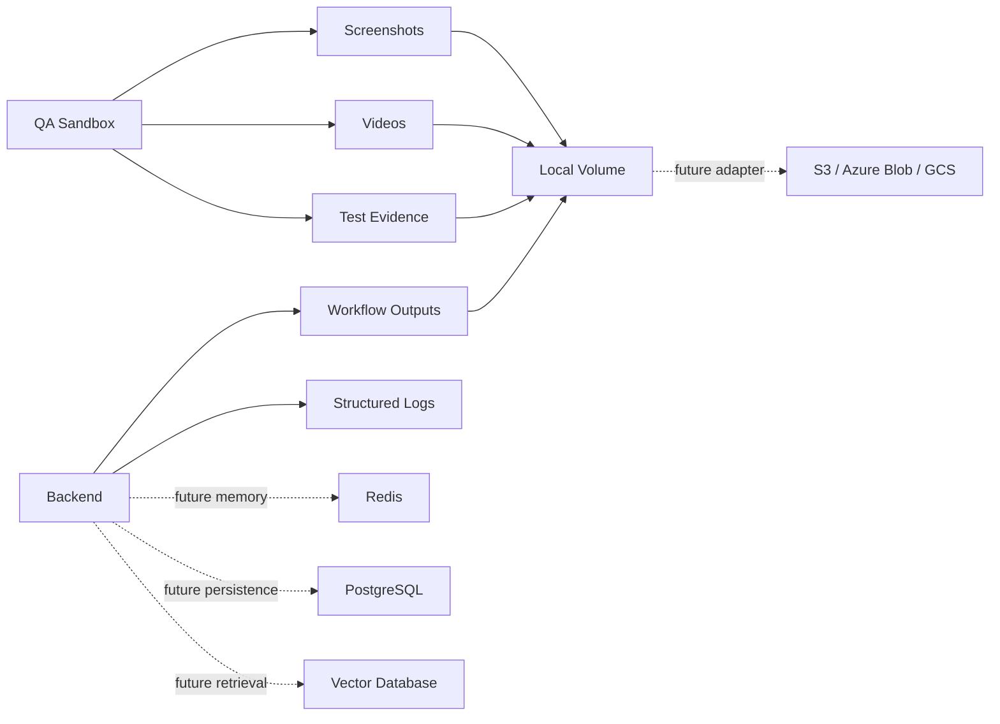
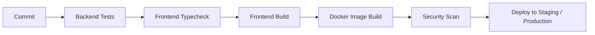

# Production Deployment Architecture

This deployment architecture keeps runtime concerns separated across backend APIs, frontend dashboard, QA sandbox execution, storage, observability, and future external persistence.

## Container Topology



## Request And Streaming Flow



## Environment Strategy

- `local`: developer-friendly Docker Compose, bind-mounted outputs, optional Redis/PostgreSQL profiles.
- `staging`: production-like Kubernetes overlay with low replica counts and isolated secrets.
- `production`: immutable images, secret-manager backed configuration, persistent storage, TLS at ingress/proxy, horizontal replicas.

Environment values are loaded from:

- `deployment/env/.env.local.example`
- `deployment/env/.env.production.example`
- Kubernetes `ConfigMap` and `Secret` objects
- Future enterprise secret stores such as Vault, AWS Secrets Manager, Azure Key Vault, or GCP Secret Manager

## Secrets Management

Never commit real secrets. Production secrets should be injected by the orchestrator.

Required secret classes:

- OpenAI/API provider keys
- application signing secret
- Redis password
- PostgreSQL password
- Datadog API key
- future GitHub/GitLab integration tokens

## Storage Architecture



## Local Development

Build and run backend plus frontend:

```powershell
docker compose -f deployment/compose/docker-compose.local.yml up --build backend frontend
```

Run optional infrastructure:

```powershell
docker compose -f deployment/compose/docker-compose.local.yml --profile infra up --build
```

Run QA sandbox profile:

```powershell
docker compose -f deployment/compose/docker-compose.local.yml --profile qa up --build qa-sandbox
```

## Production Compose

Build images:

```powershell
docker build -f deployment/docker/backend/Dockerfile -t multi-agent-delivery-backend:latest .
docker build -f deployment/docker/frontend/Dockerfile -t multi-agent-delivery-frontend:latest .
docker build -f deployment/docker/qa-sandbox/Dockerfile -t multi-agent-delivery-qa-sandbox:latest .
```

Run production-like compose:

```powershell
docker compose --env-file deployment/env/.env.production.example -f deployment/compose/docker-compose.production.yml up -d
```

## Future Kubernetes

Kubernetes manifests are intentionally provider-neutral and Kustomize-ready:

```powershell
kubectl apply -k deployment/kubernetes/overlays/staging
kubectl apply -k deployment/kubernetes/overlays/production
```

Production ingress, certificate management, network policies, external Redis/PostgreSQL, and object storage should be added as environment-specific overlays.

## CI/CD Readiness

The GitHub Actions workflow validates:

- backend tests
- frontend typecheck
- frontend production build
- Docker image builds

The same stages map cleanly to GitLab SaaS CI:



## Secure Defaults

- containers run as non-root users
- production compose applies `no-new-privileges`
- Linux capabilities are dropped where practical
- runtime outputs are isolated to mounted volumes
- real secrets are excluded from Git
- QA artifacts are stored separately from API runtime outputs
- Redis/PostgreSQL are extension profiles until real adapters are enabled

